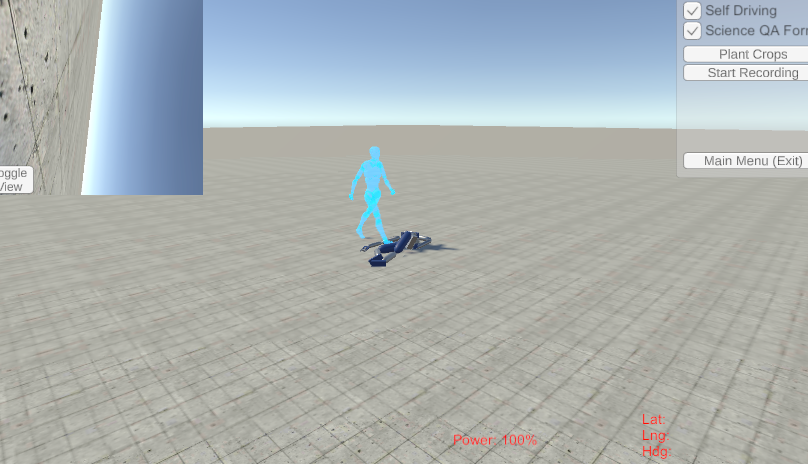
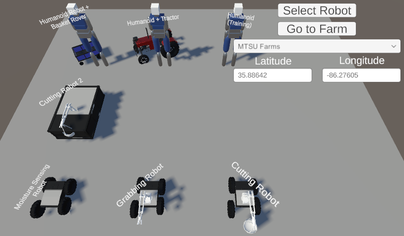
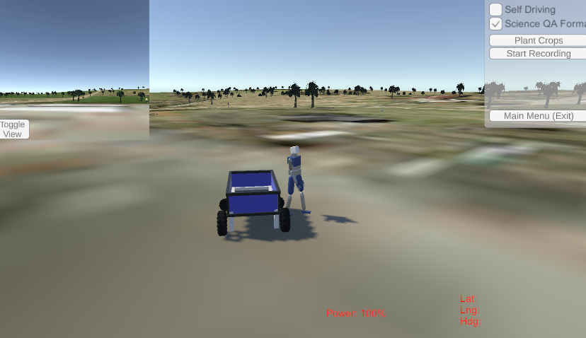
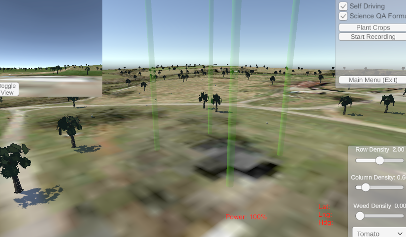
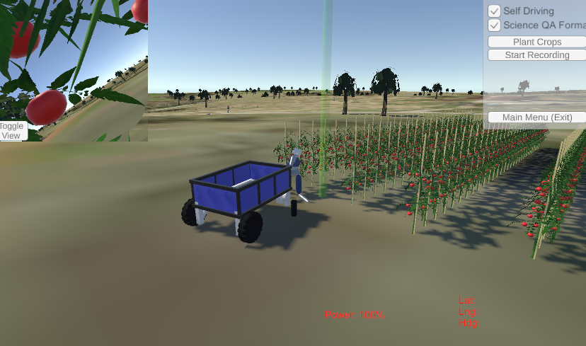
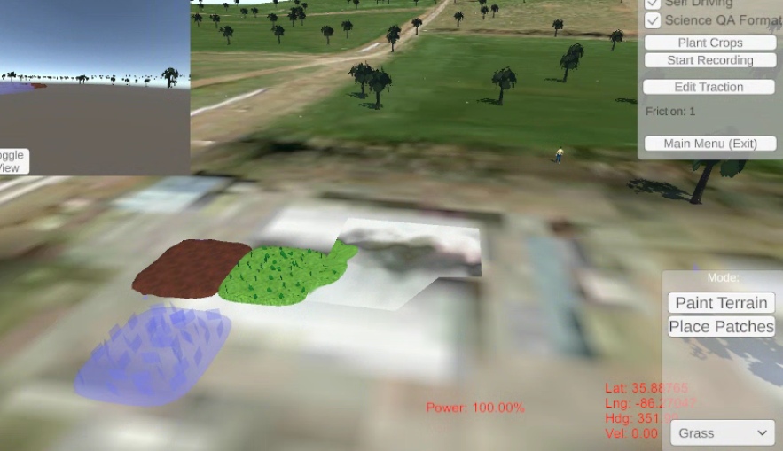
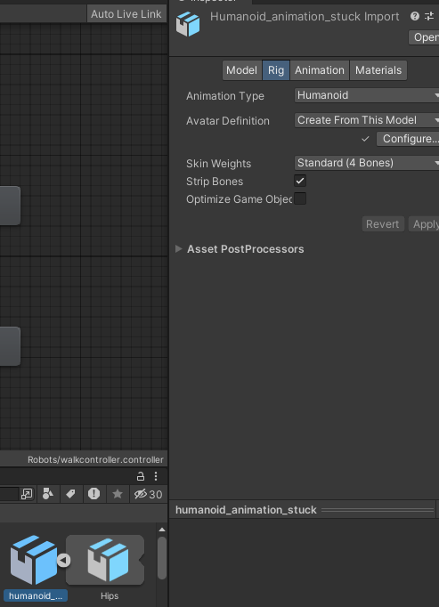
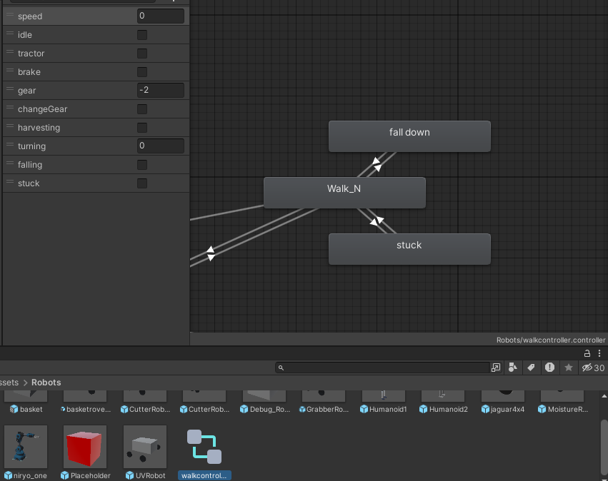

# Farming Simulator

### When first opening, make sure you open the correct scene by double clicking on Assets/Scenes/SampleScene.unity

## Developer's Guide

### Scripting
Scripts are stored in Assets/Scripts. Some important scripts are:

 - Interface/PathMaker.cs: Using PathMaker.Instance serves as a singleton, and stores data and variables to be accessed from any script. It also stores and generates waypoints for robots to move to.
 - Interface/SelectMenu.cs: Generates the list of robot selectables in the main menu. The prefabs of robots are referenced by a list of RobotInfo objects, which are separated by type.
 - Robots/HumanoidRobot.cs: Defines the main behavior for the humanoid robot.
 - Training/MLHumanoidController.cs: Implemented in a separate GameObject attached to the humanoid robot, this class is used for training the humanoid robot to walk. This is optional if you are manually controlling the humanoid, or using kinematic self-driving for the humanoid.
### Training

Inside the repo is a folder called ml-agents-release_22, which is a repackaged re-upload of Unity's ML-Agents repo. By navigating to this folder, you can run the command:

    mlagents-learn humanoidconfig.yaml --run-id=run_name

To run the trainer, which will save the results in results/run_name.

Then, run the game, and select the Humanoid (Training) option, and start it. The humanoid will automatically connect, and begin training. Fitness is defined in the Director script, and currently is set to try to train for walking forwards.

# User's Guide

To use the game as a user, start the game. It will take you to a selection screen. Press the "Select Robot" button, and then click on one of the robots. You can then either select a pre-defined location from the drop-down menu, or enter the coordinates of your farm. When you are finished, press the Go to Farm button.

After a few seconds, the terrain will load, and your robot will be placed in the center. There are a few options on the right:

 - Self Driving: If checked, the rover or humanoid will drive itself via script to harvest or perform actions on crops. If unchecked, the user has control over the rover or humanoid. The WASD or arrow keys can be used to control movement. If the rover has an arm, the user can hold down a number key and use W or S / up arrow or down arrow to control that joint.
 - Science QA Format: If checked, any recordings made will have the inputs converted to a human-readable question and answer format, asking what the rover should do given the current frame and situation. If unchecked, the recording data is saved as raw text files with floats from 0 - 1 for the controls.
 - Plant Crops: Goes into planting mode.
 - Start Recording: Begins recording the game. Images are saved every frame, using the rover's camera. Along with each image saved, a text file is saved giving the current position, velocity, and other variables, and the current output. This is the data to be used to train via imitation learning.
 - Main Menu (Exit): Returns to the main menu.

### Planting

If you press the Plant Crops button, the camera angle will change, and you will enter planting mode. You can use the WASD/arrow keys to move the camera. A new menu will also pop up with different crops. Row and column density determine how many crops are planted per row and column, these must be above zero or no crops will be planted. Weed density controls how many weeds are present in the plot.

Once you have your desired settings, click and drag on the map. It will create a square plot, and you can place multiple plots. Once you are finished, you can press enter, and the crops will be planted.

Now that the crops are planted, if you are in self-driving mode, the rover or humanoid will attempt to harvest the crops. This usually where you want to start recording.

### Traction Spots

You can place different spots or patches that have different traction values. For instance, grass has low traction, water has lower traction, and rovers can get stuck in dirt. To place these spots down, press the "Edit Traction" button, and select the patch type. You can then place down the objects, highlighted by a blue outline.

## Animations

Animations are stored as .fbx file in the Animations asset folder. You can either manually create them, or use MoMask and our conversion script in the 

After importing a new animation, you need to set the avatar to be humanoid, or the animation will not work.

Once you have finished importing and setting the animation to be humanoid, you can then navigate to the Robots folder, and double click on walkcontroller.controller, and it will open up the animator window. You can drag and drop imported animations (for .fbx files, make sure to click the side arrow to expand the file to see the animation clips stored within) into the animator window, and create transitions from there.
